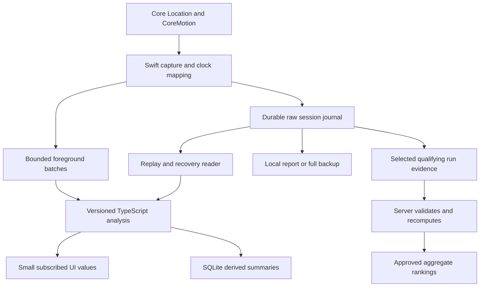

# Proposed architecture and decisions

Phase 1 recommendation — 30 September 2026, updated as Phase 2 build preparation begins. Screen implementation waits for the screenshot approval requested in the brief; the first draft needs revision. Native recording and backend implementation remain pending.

## Scope and alternatives

The product is an iOS 17+ private riding instrument for 1–10 friends, operated from Windows and distributed as unsigned cloud-built IPAs that each friend signs locally. Reliable measurements, clear uncertainty, Thai-first text and free operation take priority over feature count. The user has confirmed an iPhone 14 Plus running iOS 26 and three vehicles: Honda PCX160, BMW S1000RR and Honda Civic RS. Other testers' phones remain unconfirmed; record country is derived from the run location, not the phone's language or IP address.

Plan separate saved vehicle profiles for PCX160 and S1000RR within the motorcycle class, and Civic RS within the car class. Store calibration against the actual phone/mount/vehicle combination; do not infer acceleration limits, braking thresholds or record authenticity from a model name. Model years and modifications are unspecified. The [test matrix](TEST_PLAN.md#confirmed-device-and-vehicles) covers baseline recording, cabin effects, motorcycle lean and vibration constraints.

The selected delivery route is public source hosting with standard GitHub-hosted macOS runners. The public repository and workflow are set up; Release and development unsigned device builds passed in workflow run #2. Sideloadly installation remains untested. Keep private ride evidence out of source and public build artifacts.

| Approach | Strength | Cost or constraint | Decision |
|---|---|---|---|
| Expo/React Native + small Swift recorder + pure TypeScript analysis | Windows UI/analysis development, replayable shared server logic, native sensors | Must own a cloud Xcode build and native lifecycle/persistence | Recommended |
| Full SwiftUI | Direct iOS APIs and simpler native UI boundary | Windows cannot run Xcode previews/debugger; more cloud rebuilds for UI and analysis changes | Viable later, weaker fit for this development setup |
| Expo Go / web app | Fast Windows prototyping | Cannot supply our custom iOS sensor payloads or satisfy dependable locked-screen recording | Keep existing prototype as a reference only |

Expo supports local Swift modules and native builds; Expo Go cannot acquire arbitrary new native modules. SDK 57's published minimum is iOS 16.4, so an application deployment target of 17.0 is compatible. Its current requirements include Xcode 26.4+; pin compatible tool versions during the build spike. [Expo SDK 57 reference](https://docs.expo.dev/versions/v57.0.0/), [Expo Modules setup](https://docs.expo.dev/modules/get-started/)

## Final recommended stack

| Layer | Choice | Reason / verification needed |
|---|---|---|
| App | Existing Expo SDK 57 family, React Native, TypeScript, Expo Router | Reuse current project, use SDK-compatible packages and committed lockfile; no Android scope |
| Native capture | Local Expo Swift module, Core Location manager initially, CoreMotion DeviceMotion/Altimeter | Capture accuracy/source fields and control foreground/background lifecycle |
| Location API choice | `CLLocationManager` baseline; isolated `liveUpdates` comparison during spike | Explicit accuracy/distance/activity/pause controls; neither API promises a specific Hz |
| Native persistence | Versioned append-only session journal in app-private files | Capture survives JS stalls; chunk sequence/checksum/flush/recovery and visible gaps |
| Analysis | Pure TypeScript package with injected clock and policy version | Same replay/filter/max/statistics logic in app, Jest and backend |
| Local index | `expo-sqlite` for session metadata, checkpoints and derived summaries | Transactional lookup/history; raw high-rate payloads stay in journals |
| Maps | `react-native-maps`, Apple MapKit provider | Native map display without paid Google map keys; gradient line support on iOS |
| Charts | Skia + Reanimated + Gesture Handler in Phase 3 | Explicit telemetry geometry and shared selection; assess `react-native-graph` as an alternative |
| Localization | i18next/react-i18next, expo-localization, `th` and `en` files | Thai default with explicit switch, native permission localizations and Intl formatting |
| Font | iOS system initially; compare bundled Noto Sans Thai before screen approval | No network font dependency; preserve Dynamic Type and Thai marks |
| Exports | Native/share-sheet export, GPX for interoperability, versioned full backup/report archive | Raw uncertainty/motion cannot be represented faithfully by ordinary GPX |
| CI | GitHub Actions standard macOS for public source; Codemagic personal free tier alternative | Unsigned Release and development-client device builds; Sideloadly signs locally |
| Backend, Phase 6 | Supabase Free Auth + Postgres/RLS + private Storage + Edge Functions | Practical small-group TS verification and indexed rankings; hard quotas and local fallback |
| Login | Invite-controlled anonymous account + nickname initially | No Apple entitlement or outbound email dependency; recovery must be designed and tested |
| Routing, Phase 5 | MapKit where verified; evaluate ORS cycling and Geoapify motorcycle/bicycle fallback | Check terms and hard-free behavior before enabling providers; no assumption that car access equals motorcycle access or offline Apple Maps downloads are an SDK API |

Versioned SQLite documentation could not be parsed by the web reader in this research pass; the current official documentation confirms the library and transactions. Re-check the SDK 57 page and installed types before implementation. No unverified method names are prescribed here. [Expo SQLite](https://docs.expo.dev/versions/latest/sdk/sqlite/)

## Data flow

Native code records first. Batches are a delivery optimization, not the source of truth. JavaScript may pause or be unavailable in the background. On resume it processes the journal from its last sequence checkpoint. Essential native work is acquisition, clock alignment, persistence and lifecycle; canonical filters/statistics remain TypeScript. No derived estimate is silently written back as a raw observation. Native sensor callbacks themselves can stop; persist and report missing intervals rather than promising uninterrupted capture. See [sensor API evidence](research/sensors.md).

“Raw” means the unmodified API payload we received. `CMDeviceMotion` is already Apple's fused motion output, not raw accelerometer/gyro hardware data. If later analysis requires the unfused streams, subscribe and label them separately after evaluating battery and storage cost.

## Session contract

- State machine: idle → permission check → acquiring → recording → stopping → complete, with explicit interrupted/recoverable and failure states. Never imply recording started while permission is denied.
- One native owner per recording session. Start in the foreground; retain the chosen location/background session objects for the necessary lifetime. Ending stops location, motion, barometer and activity subscriptions, flushes the journal, and releases keep-awake.
- Each payload includes schema version, session/sample ID, source kind, sensor measurement timestamp, monotonic receive timestamp, wall-clock mapping, validity/accuracy fields, permission mode and supplied source flags. Missing is distinct from zero.
- `CLLocation.timestamp` and CoreMotion uptime-based timestamps need a recorded mapping. Wall-clock changes, reboot and suspend discontinuities produce new clock segments. Timer math must never depend on a phone wall clock that can jump.
- Persist latitude/longitude, altitude/vertical accuracy, speed/speed accuracy, course/course accuracy, source information, DeviceMotion attitude/gravity/user acceleration/rotation, and barometer values when available. Record units and coordinate frames explicitly.
- The writer appends bounded chunks with sequence numbers, checksums and schema versions. Choose a flush interval after measuring energy versus recoverable-loss window; record that window in reports. Low disk stops or degrades visibly; it never silently discards raw data while reporting a complete session.
- Configure file protection so the active journal can be written after the first unlock while the phone is locked; test that on-device. This has a data-at-rest tradeoff and does not permit recording before the first unlock after reboot. [Apple file-protection mode](https://developer.apple.com/documentation/foundation/fileprotectiontype/completeuntilfirstuserauthentication)
- SQLite is a rebuildable index of raw journals plus durable user metadata. Avoid simultaneous native and JS writers to the same SQLite connection/database during v1. Import backups transactionally; validate version/length/checksum before committing.

## Honest analysis and replay

Every result carries value or null, units, coverage, quality reasons, source type, algorithm/policy version, and an uncertainty estimate only where justified. A small formal `±` must not be manufactured from an arbitrary quality badge. GPS gaps produce incomplete distance/time/altitude segments, not straight-line or inertial guesses presented as measurements. The proposed primary max is the highest minimum accepted speed over a supported full three-second window, labelled as sustained for three seconds; it deliberately understates brief peaks. A one-sample peak remains diagnostic evidence only. See question 7 in the sensor report for support and cadence requirements.

Real sessions, imported full recordings and GPX replay feed one analysis interface. Replay supplies a virtual clock. Original sample timestamps and provenance remain unchanged. Ordinary GPX often lacks speed accuracy, motion and source flags, so derived GPX speed is explicitly approximate and replay is permanently excluded from rankings. Saved summaries can be recalculated when the algorithm changes without changing the original capture.

Country detection operates on consented run coordinates using a versioned boundary source. A profile country and a run country are different fields. Border ambiguity, multi-country travel or weak location must be handled explicitly; do not guess from IP. Route planning should use the current approved location only after permission, and never upload an entire private ride for a simple directions request.

## Storage, integrity, privacy and quotas

Keep full sessions on the phone. Export reports on demand through a review/share action; raw reports contain exact locations and need a clear Thai explanation. GPX export, public ride sharing and raw diagnostic sharing are separate choices. A GPX is not a backup of sensor evidence or settings.

Upload only candidate run windows with adequate pre/post context, and complete lap evidence where needed. Do not cut evidence to only the fastest three points. Server validation checks size/schema/timestamps/quality/simulation/replay/context/course/policy and recomputes. It may still accept fabricated physically plausible traces: without trusted attestation/hardware, this is moderated, evidence-based competition, not cheat-proof certification.

Use private buckets, server-only verification privileges, RLS, no public raw URLs, and precomputed approved ranking rows. Adopt a small per-user submission allowance, a rolling evidence retention budget, and refusal when quotas approach the free plan. Durable record metadata can outlive raw retention, but mark whether evidence is still available for audit. See [backend budget and threat model](research/backend-and-routing.md).

Use UTC calendar weeks and months for ranking periods, while formatting dates in the user's selected locale. Course/layout/direction, vehicle, receiver class and rollout method define separate comparable boards. Unknown or overlapping measurement uncertainty should produce coarse ordering or ties, not false millisecond distinctions.

## Delivery pipeline and version identity

1. Windows changes run TypeScript, lint and Jest; use synthetic or consented sanitized fixtures.
2. The cloud Mac installs pinned dependencies, runs Expo prebuild and CocoaPods, and builds an **arm64 iOS device** app with signing disabled. It packages `Payload/<name>.app` at the IPA root. No Apple ID/password/certificate is needed for that unsigned build.
3. Produce Release with its bundled JS and a development-client build for Metro. A development client is still a device executable that must be signed; a simulator `.app` cannot be substituted.
4. On a version tag, attach the unsigned Release IPA, checksum, source revision and short Thai changelog to a GitHub Release. Do not include test routes, user records or secrets. This is a Phase 2 workflow requirement, not an existing release.
5. Each friend signs locally using Sideloadly and their own Apple ID. Test a data-preserving second installation before broader testing. Keep a fixed bundle identifier and that friend's signing identity; Apple ID/team changes may prevent an in-place update.

Proposed release bundle ID: `app.ridespeed.friends`, to freeze before first distribution. Use increasing semantic app versions and a monotonically increasing iOS build number. An optional `.dev` bundle permits both installs but consumes another free-sideload app slot and has a separate database; the first developer can use one build at a time if slots are tight. Final ID/toolchain selection and repository visibility happen at Phase 2 kickoff. [Detailed unsigned build and Windows steps](research/build-and-sideloading.md)

## What changes for an App Store release

- Enroll in Apple's paid Developer Program, adopt normal signing/provisioning, App Store Connect and TestFlight distribution; sideload refresh is no longer the installation path.
- Revisit authentication and capabilities: Sign in with Apple rules for any added third-party login, push notifications, App Attest/device support and server validation, iCloud backup and Game Center only if wanted. Attestation strengthens provenance but still does not prove the vehicle or safe driving.
- Provide a privacy policy, accurate App Privacy disclosures, required-reason API/privacy manifests and usage descriptions; audit dependency manifests and analytics.
- Demonstrate a legitimate foreground/background location purpose, permission minimization, sensible battery behavior, account deletion if accounts exist, and secure export/deletion of local and server data.
- Review current App Review rules for user-generated content, reporting/moderation/blocking, ranking safety, age rating, accessibility and purchase policies. Verify OSS/data/routing/font licenses and required attribution before distribution.
- Supply screenshots/localizations/support contact, reviewer instructions, appropriate test access, production monitoring and a sustainable backend budget. A public audience may exceed free tiers; the current architecture must fail gracefully instead of silently charging.
- Re-test Live Activities, Watch companion targets, and app-group/extension provisioning separately. They are later projects, not assumed to work in the first sideload build.

This is a preparation checklist, not an App Review outcome. Re-check current rules at the release phase. [Apple membership](https://developer.apple.com/programs/), [App Review Guidelines](https://developer.apple.com/app-store/review/guidelines/), [Privacy manifests](https://developer.apple.com/documentation/bundleresources/privacy_manifest_files)
